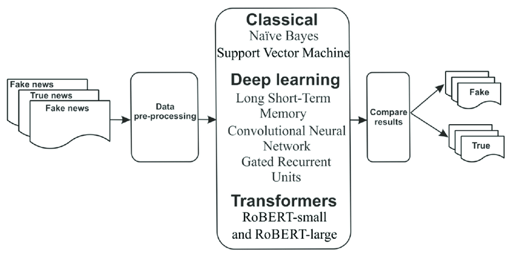

# Fake News Detection - DMTA 2023/2024

Fake News Detection project for Data Mining and Text Analytics unit




*Image from [this paper](https://arxiv.org/abs/1408.5882).*


## Introduction
Welcome to the Fake News Detection project! In today's digital age, the spread of misinformation is a significant concern. This project leverages the power of Neural Networks to tackle the issue of fake news by analyzing news headlines and classifying them as either real or fake.

**Note:** Initially, we experimented with the Multinomial Naive Bayes (MultinomialNB) model, and the classifications appeared to be correct. However, seeking to explore the potential of Neural Networks, we decided to construct a custom model with the assistance of ChatGPT. Our aim is to compare the results of the Neural Network with the initial MultinomialNB model.

## Description

The project aims to create a model capable of distinguishing between true and false news, thereby contributing to mitigating the spread of misleading information.

## Key Features

- Text analysis to identify common traits of fake news.
- Utilization of machine learning algorithms for news classification.

## System Requirements

- Python 3
- Machine learning libraries such as pandas, numpy, sklearn and tensorflow.
- Other specific requirements for your development environment.

## Installation

Make sure you have Python installed on your machine. 
You can install the required packages using the following command on your terminal or bash shell:
```
pip install requirements.txt
```

##### Clone the repository
```
git clone https://github.com/gerakys/PyhtonProject_DMTA.git
```

##### Navigate to the project directory 
```
cd PythonProject_DMTA
```


## Usage

To use the fake news detection project, follow the steps below:
```
python Neural_Net_FND.ipynb
```


## License

This project is distributed under the MIT License. Read the LICENSE.md file for further details.

## Contact

- Gabriel Geraci, Lorenzo Fratini
- {gabriel.geraci1, lorenzo.fratini1}@studenti.iulm.it
- Linkedin Profiles: [Gabriel](https://www.linkedin.com/in/gabrielgeraci/), [Lorenzo](https://www.linkedin.com/in/lorenzo-fratini-0838a5265/)

## Project Status

Currently, the project is in active development. Check the repository issues for the latest challenges and planned improvements.

## Acknowledgments

We would like to acknowledge and express our gratitude to the following articles and websites that have greatly contributed to the development and inspiration of this fake news detection project:

- [Automatic Fake News Detection for Romanian Online News.](https://www.researchgate.net/publication/359252597_Automatic_Fake_News_Detection_for_Romanian_Online_News): This article provided valuable insights into various methodologies for detecting fake news, shaping our overall approach and strategies..
- [Article Title 2](https://arxiv.org/ftp/arxiv/papers/2201/2201.07489.pdf): The concepts and techniques discussed in this article played a pivotal role in enhancing our understanding of machine learning applications in text classification, a fundamental aspect of our project.
- [Kaggle](kaggle.com): This is where we found our dataset

We would like to express our appreciation to the creators and contributors of the following GitHub repository:

- [Text Classification](https://github.com/cezannec/CNN_Text_Classification): This source inspired us on how build a clean github repository
- [Sentiment Analysis with an RNN](https://github.com/udacity/deep-learning-v2-pytorch/blob/master/sentiment-rnn/Sentiment_RNN_Solution.ipynb): This resource provided valuable code snippets, insights, or inspiration that significantly contributed to the development of our project.

We would like to extend our sincere gratitude to Professor Bruno for his guidance, support, and invaluable insights throughout the development of this project. His expertise and encouragement played a crucial role in shaping our understanding and approach.

These sources played a significant role in shaping our understanding and approach to fake news detection.
